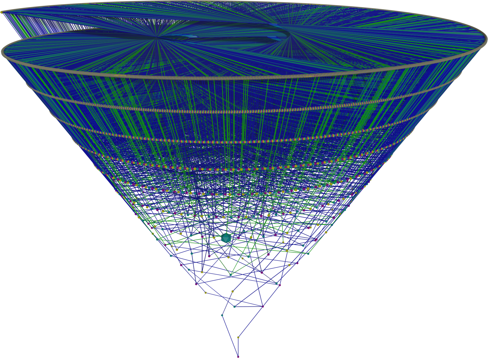

# Tree Overlay

This page contains the code to create two overlapping cones starting from different numbers.

---

A tree with a height of 10 starting from node number 1 superimposed with a tree starting from 161.

