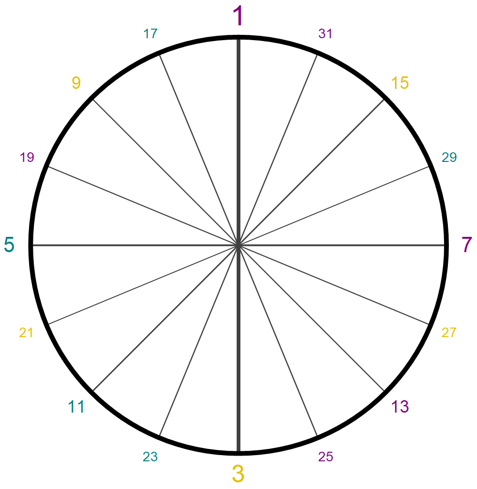
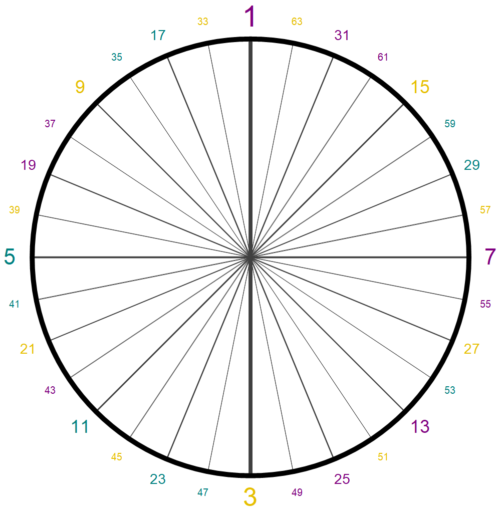
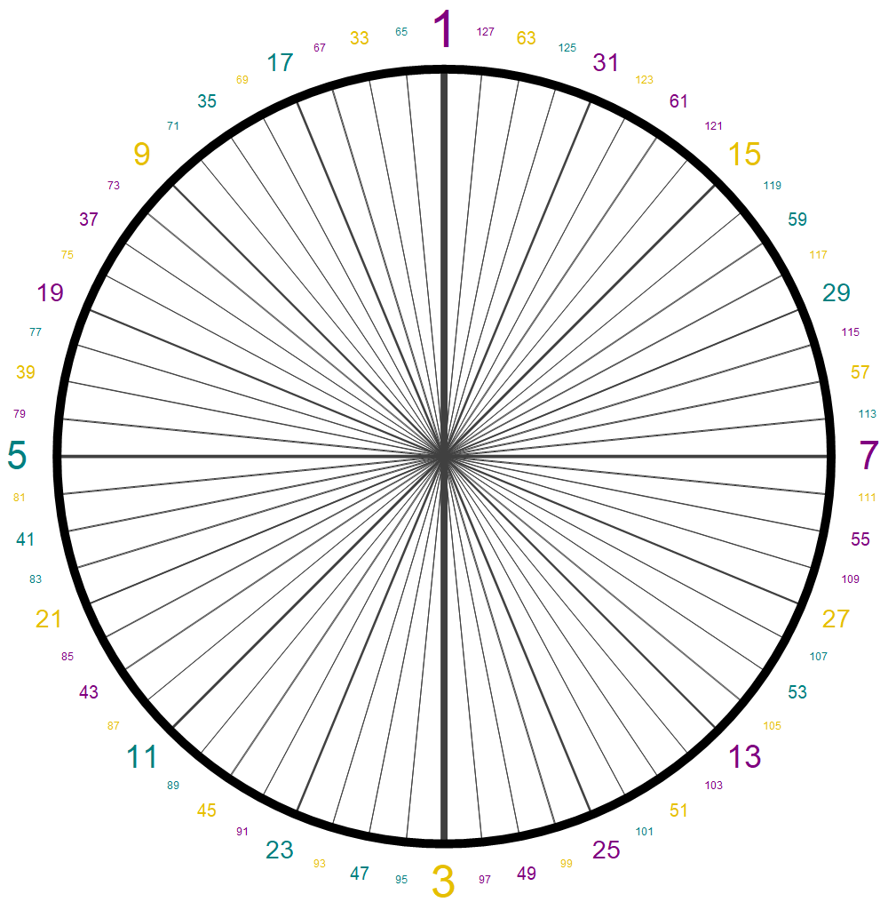
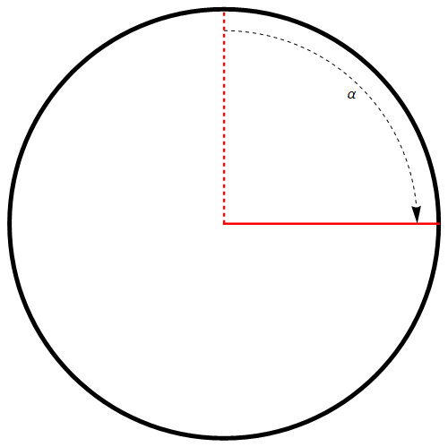

# Distribution Around the Circle

This page contains the Wolfram Mathematica code to show the distribution of the nodes of each row.

---

| _Up to 31_                | _Up to 63_                | _Up to 127_               |
| ------------------------- | ------------------------- | ------------------------- |
|  |  |  |

