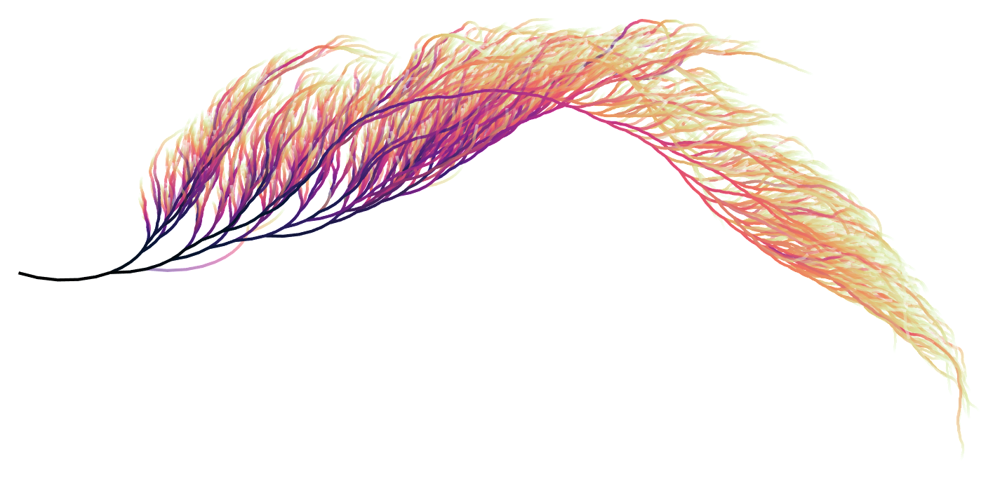

# Collatz Feather

This page contains the Wolfram Mathematica code to visualize the Collatz feather.

---

---

## Sources

- [Collatz sequences visualization in Mathematica 10.1+](https://github.com/level1807/collatz/tree/98371020b91aa51d681e5b12b9f21ba8180183a0)
- [Mathematia Stackexchange](https://mathematica.stackexchange.com/a/85731)
