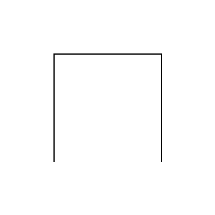

# Hilbert Curve

This page contains the Wolfram Mathematica code to show the iterations of the Hilbert curve.

---

*Iteration 1*

*Iteration 2*

*Iteration 3*

*Iteration 6*

---

## Sources

[Hilbert Curve - Wolfram Language Reference](https://reference.wolfram.com/language/ref/HilbertCurve.html)