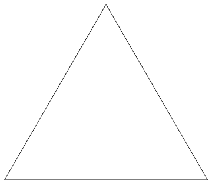
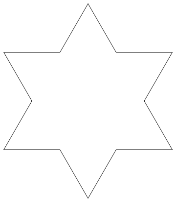
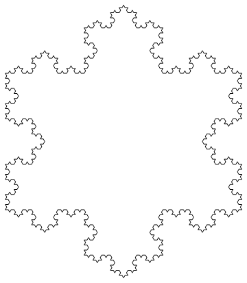

# Koch Snowflake

This page contains the Wolfram Mathematica code to show the iterations of the Koch snowflake.

---

*Iteration 0*

*Iteration 1*

*Iteration 4*

---

## Sources

[Koch Curve - Wolfram Language Reference](https://wolfram.com/xid/0mlj65sra07i-pd44os)