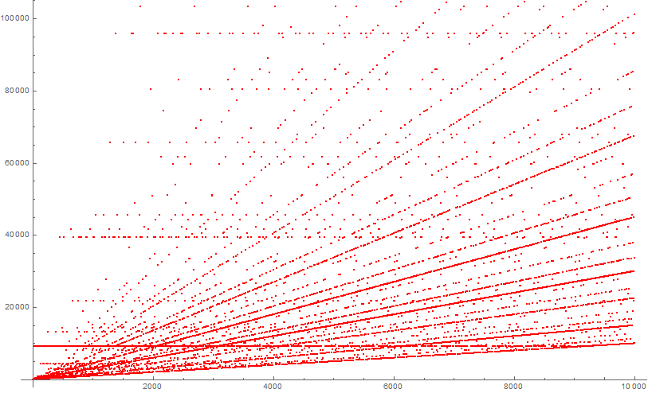

# Max Values

This page contains the Wolfram Mathematica code to show the maximum value reached in Collatz steps for each number up to 10^4.

---

---

## Sources

[Collatz - Wolfram Function Repository](https://resources.wolframcloud.com/FunctionRepository/resources/Collatz)
[Collatz Conjecture Graph Max Values](https://en.wikipedia.org/wiki/File:CollatzConjectureGraphMaxValues.jpg)
