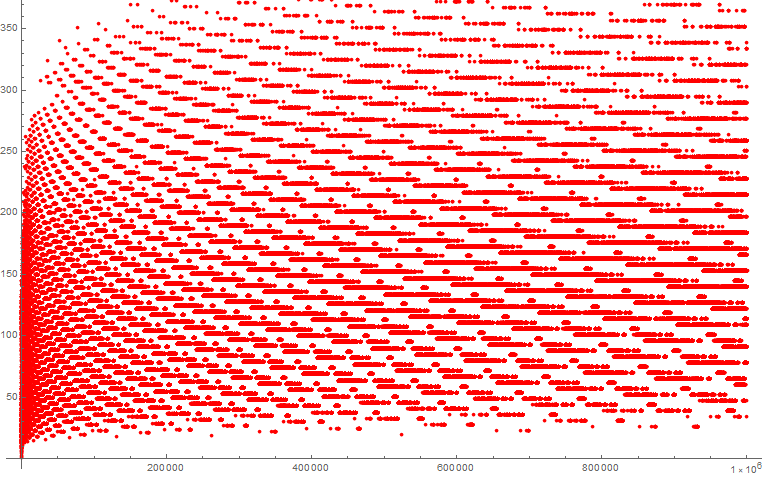

# Steps to reach 1

This page contains the Wolfram Mathematica code to show the amount of Collatz steps for each number to reach 1 up to 10^6.

---

---

## Sources

- [Collatz - Wolfram Function Repository](https://resources.wolframcloud.com/FunctionRepository/resources/Collatz)
- [Collatz Problem - Wolfram Math World](https://mathworld.wolfram.com/CollatzProblem.html)
