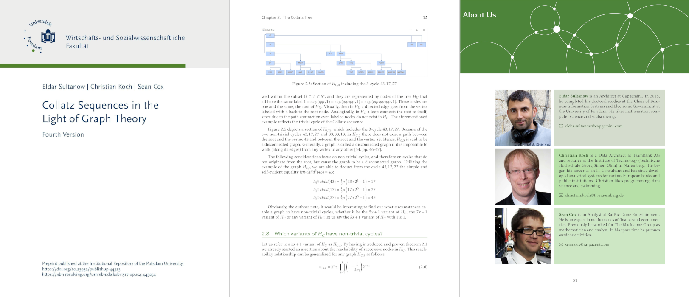

# TeX Sources: Collatz Sequences in the Light of Graph Theory

Here you find all TeX sources for our manuscript "Collatz Sequences in the Light of Graph Theory" including supporting Python scripts and Mathematica Workbooks.

# News

Added validation script for
% \f is defined as f(#1) using the macro
\f{x} = \int_{-\infty}^\infty
    \hat \f\xi\,e^{2 \pi i \xi x}
    \,d\xi

# Download
The manuscript can be downloaded at:
https://doi.org/10.25932/publishup-44325

