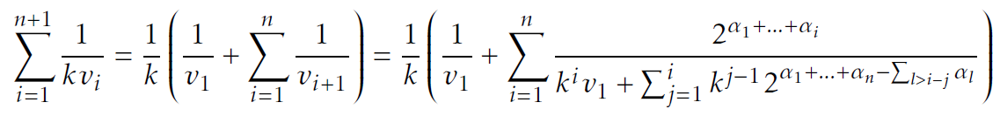

# Sources for the exploration of Collatz Sequences: TeX, Mathematica and Python 
Here you find all sources for our manuscripts (TeX) and programmatic investigations (Python scripts and Mathematica workbooks).
The first turf cut and trigger for the whole project is a continuously evolving manuscript "Collatz Sequences in the Light of Graph Theory", originally published by the University of Potsdam. It is an Open Book, that can be downloaded here and everyone is invited to contribute.

# Publications
[//]: # * [11/2020: SciPress](https://www.scipress.com/IJPMS.21): Divisions by Two in Collatz Sequences: A Data Science Approach
* [11/2020: publish.UP](https://doi.org/10.25932/publishup-48214): Collatz Sequences in the Light of Graph Theory (Fifth Version)
* [05/2020: opus4.kobv](https://doi.org/10.34646/thn/ohmdok-620): Divisions by Two in Collatz Sequences: A Data Science Approach (2nd ed.)
* [12/2017: SciPress](https://www.scipress.com/IJPMS.19.10): Introducing a Finite State Machine for Processing Collatz Sequences

# Recent activities
Added Python script for validating the sum:

# Connect with us
We are on [Researchgate](https://www.researchgate.net/project/Collatz-Conjecture-4) and open for any question and collaboration.

